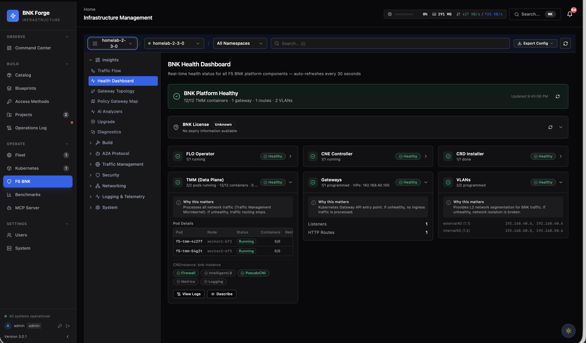

<!-- _class: lead -->
<!-- _paginate: false -->

# dpubnkctl

<div class="sub">F5 BIG-IP Next for Kubernetes — deploy in one binary, drive with an agent.</div>

<div class="meta">
BNK 2.3.0 · NVIDIA BlueField-3 (DOCA 3.2.0) · k8s 1.30 · kubespray v2.28.1<br>
2.2 maintenance on <code>release-2.2.0</code> · 2.3 on <code>release-2.3.0</code> · <code>main</code> toward 2.4<br><br>
Marcel Wiget · github.com/mwiget/dpubnkctl
</div>

---

<!-- _class: toc -->

## Contents

<div class="toc-row"><span class="toc-num">PART 1</span><span class="toc-title">Why dpubnkctl</span><span class="toc-tagline">a multi-step BNK deploy compressed into one binary</span></div>
<div class="toc-row"><span class="toc-num">PART 2</span><span class="toc-title">Architecture &amp; operation</span><span class="toc-tagline">two repos, 8 phases, two operating modes</span></div>
<div class="toc-row"><span class="toc-num">PART 3</span><span class="toc-title">The agentic loop</span><span class="toc-tagline">personas, AGENTS.md, four diagnosis case studies</span></div>
<div class="toc-row"><span class="toc-num">PART 4</span><span class="toc-title">BNK 2.3.0 migration</span><span class="toc-tagline">License CR, release-manifest, eight new audit items</span></div>
<div class="toc-row"><span class="toc-num">PART 5</span><span class="toc-title">Day 2 &amp; beyond</span><span class="toc-tagline">bnk-forge integration, caveats, what's next</span></div>

---

<!-- _class: section-divider -->

<div class="num">Part 1</div>

# Why dpubnkctl

<div class="tagline">A multi-step BNK deploy compressed into one binary</div>

---

## Why this exists

Manual BNK-on-bare-metal deploy is 20+ steps across several distinct toolchains:

- BFB flash the DPU (mlxconfig, rshim, bf.conf)
- Host VLAN sub-interfaces (netplan)
- Kubespray cluster bring-up
- Externally join DPUs to k8s
- Multus + SR-IOV + NADs
- cert-manager + F5 Lifecycle Operator (FLO)
- CNEInstance + F5SPKVlans + Gateway / HTTPRoute

29 numbered failure modes catalogued in `AGENTS.md`. Easy to misorder. Painful to redo from a partial state.

> dpubnkctl is the runbook turned into a single Go binary with persistent declarative state.

---

<!-- _class: section-divider -->

<div class="num">Part 2</div>

# Architecture & operation

<div class="tagline">Two repos, 8 phases, two operating modes</div>

---

## Two-repo architecture

```
+----------------------------------------------+
|  dpubnkctl source — single binary,           |
|  BNK-2.3.0-pinned (DOCA, BFB, FLO,           |
|  kubespray); stamped with `git describe`     |
|                                              |
|     internal/                                |
|     embedded/files/AGENTS.md                 |
|     embedded/files/personas/                 |
+----------------------------------------------+

              | `dpubnkctl init <name>`
              v

+----------------------------------------------+
|  <customer>-poc repo — declarative state.    |
|  Every input needed to teardown + redeploy   |
|  lives here. poc.yaml.status tracks phase    |
|  progress.                                   |
|                                              |
|     poc.yaml                                 |
|     AGENTS.md + personas/                    |
|     keys/   (gitignored)                     |
|     artifacts/, journal/, decisions.md,      |
|     diagram.txt                              |
+----------------------------------------------+
```

The binary is the engine. The PoC repo is the contract.

---

## 8-phase pipeline

```
1. validate            poc.yaml schema sanity + phase-tagged rules
2. provision dpu       BFB flash, mlxconfig SR-IOV, bf.conf, wait
3. host network setup  netplan VLAN sub-interfaces
4. cluster up          kubespray cluster.yml
5. cluster join-dpus   externally join BlueField nodes to k8s
6. deploy network      Multus + SR-IOV CNI + NADs
7. deploy flo          cert-manager + F5 Lifecycle Operator
8. deploy cne          CNEInstance + F5SPKVlans + BNK GatewayClass
```

Symmetric teardown: `destroy bnk → destroy dpus → cluster reset`. Both directions resume-safe via `artifacts/e2e-state.json`.

```
dpubnkctl e2e --yolo                            # ~75 min, resume-safe
dpubnkctl destroy --yolo --confirm-cluster <name>
```

---

## What `init` creates

```
poc.yaml                  single source of truth — every input
                          to teardown / redeploy lives here

AGENTS.md                 persona-neutral runbook (embedded)
personas/
  pre-sales-se.md         only persona that talks to the customer
  lab-tech.md             DPU / BMC / firmware specialist
  doc-specialist.md       journal + final-report keeper

network-design-checklist.md   SE-fills-in before provisioning
inventory/                discover output (json)
artifacts/                rendered manifests, kubeconfig
journal/                  append-only, one file per phase
decisions.md              SE decision log
keys/                     FAR, JWT, SSH keys (gitignored)
diagram.txt               auto-regenerated topology view
```

---

## Two operating modes

### Agentic

```bash
dpubnkctl agent claude            # prints the invocation
cd ~/lab/mycustomer && claude
# Inside the session:
"Read AGENTS.md, act as the pre-sales SE persona. Confirm scope with me."
```

Every agentic CLI inherits the same runbook, tool allowlists, handoff protocol. **dpubnkctl ships no LLM. You pick the model.**

### Non-agentic — wizard-driven

```bash
dpubnkctl init mycustomer --customer "MyCustomer"
cp <ssh-key> <far.tgz> <jwt>  mycustomer/keys/
cd mycustomer && dpubnkctl wizard
dpubnkctl validate && dpubnkctl e2e --yolo
```

6 operator answers + 5 Enter-presses on network-design defaults → deployable PoC. Both workflows have been validated end-to-end against the homelab.

---

## Non-agentic walkthrough — what the wizard asks

| Prompt | Default | Notes |
|---|---|---|
| Subnet or range to scan | (required) | `192.168.68.0/24`, `192.168.68.66-71`, single IP |
| SSH user | `ubuntu` | shared across the range |
| SSH port | `22` | re-prompts on bad input |
| SSH private key | `~/.ssh/id_ed25519` | must be readable |
| Jumphost (optional) | blank | format `host[:port]` |
| Role per discovered host | suggested | `both` \| `control-plane` \| `worker` \| `skip` |
| Customer name | from `--customer` | for the final report |
| External VLAN tag / subnet | `40` / `192.168.40.0/24` | north-south VLAN |
| Internal VLAN tag / subnet | `50` / `192.168.50.0/24` | east-west / cluster VLAN |
| `node_ip_role` | `internal` | which VLAN kubelet `--node-ip` binds to |

---

## Non-agentic walkthrough — what the wizard fills

Auto-filled from documented conventions (no prompts):

- `hosts[].data_plane.parent_iface` — Mellanox heuristic (`ens.*np0`)
- `hosts[].data_plane.vlans[]` — IPs mirror mgmt last-octet (`.66` → `.40.66/24`, `.50.66/24`)
- `hosts[].dpus[].{hostname, tmfifo_ip, vlans[]}` — `<host>-bf3`, `192.168.100.2/30`, sequential `.5/.6/.7`
- `network.cluster_apiserver_address` — first CP host's internal-VLAN IP
- `bnk.{external,internal}_selfip` — `.100` in each subnet
- `topology` — `mode`, `lag`, `expected_hosts`, `expected_dpus_per_host` from merged `hosts[]`

Re-running the wizard against an existing `poc.yaml` is non-destructive — operator edits are never clobbered.

---

## `diagram.txt` — homelab, real run

```
K8s cluster: homelab
====================

  +--------------------------+    +--------------------------+
  |         worker1          |    |         worker2          |
  |           both           |    |          worker          |
  |    eth0 192.168.68.66    |    |    eth0 192.168.68.71    |
  +--------------------------+    +--------------------------+
                |                                |
                | kubeadm join                   | kubeadm join
                v                                v
  +--------------------------+    +--------------------------+
  |       worker1-bf3        |    |       worker2-bf3        |
  |        DPU worker        |    |        DPU worker        |
  |          (LAG)           |    |          (LAG)           |
  |  oob_net0 192.168.68.96  |    |  oob_net0 192.168.68.79  |
  +--------------------------+    +--------------------------+

  apiserver: 192.168.50.66:6443  (all 4 nodes connect here)
```

Auto-refreshed whenever any phase mutates `poc.yaml`.

---

<!-- _class: section-divider -->

<div class="num">Part 3</div>

# The agentic loop

<div class="tagline">Personas, AGENTS.md, four diagnosis case studies</div>

---

## Embedded `AGENTS.md` — the runbook

Every `dpubnkctl init` drops a persona-neutral `AGENTS.md` into the PoC repo. Single doc, agentic-CLI-agnostic. Three sections:

- **Source of truth** — `poc.yaml` is the contract. `decisions.md`, `journal/`, `inventory/`, `artifacts/`, `keys/` each have a documented role.
- **YOLO tiers** — read-only (always auto), reversible (auto with `--auto reversible`), destructive (`--yolo` + matching PoC-name confirm). Agents must respect.
- **29 numbered gotchas** — every recurring failure from past PoCs (24 from the 2.2 round + 5 from the 2.3 migration). One-line symptom / cause / fix. e.g.:

> **#8.** OVS internal ports default to MTU 1500; apiserver TLS handshakes hang from frame loss. Fix: `bf.conf` sets MTU on every internal port.

Agents read `AGENTS.md` first, every session. **New PoCs inherit every lesson the prior PoCs paid for.**

---

## Three personas — separation of duties

Each persona has a **strict tool allowlist** + **NOT-allowed list** + a journal-based handoff protocol. Same constraints regardless of which agentic CLI runs.

- **`pre-sales-se`** — solution architect. *Only* persona that talks to the customer. Owns `decisions.md`. Cannot run destructive commands.
- **`lab-tech`** — DPU / BMC / rshim / mlxconfig / firmware specialist. Runs `discover` + `provision`. Must journal an SE-consent reference before any destructive action. Cannot modify `poc.yaml`.
- **`doc-specialist`** — append-only journal keeper. Writes the day-end summary and final `report.md`. Cannot run infra commands.

The `journal/` directory is the handoff bus: SE consent → lab-tech executes + records → doc-specialist rolls into the report. **Every persona transition is auditable.**

---

## The feedback loop

The PoC repo isn't a one-way deliverable — it's a feedback channel.

```
+----------------------+   journal entries        +----------------------+
| PoC repo             | ────── lessons-learned ──>| dpubnkctl source     |
| (per customer)       |       audit punch list   | repo (engineering)   |
|                      |                          |                      |
| AGENTS.md  <-- embedded/files/AGENTS.md  -------+ AGENTS.md +29 gotchas|
| personas/  <-- embedded/files/personas/  -------+ personas/            |
| code       <-- new pinned binary release -------+ internal/            |
+----------------------+                          +----------------------+
```

Lessons surface in **three** ways:

1. **As code** — validate rules, pre-flight checks, readiness gates
2. **As docs** — numbered `AGENTS.md` gotcha (humans + agents read it)
3. **As persona text** — workflow guidance the agent honors per-PoC

The next PoC starts with stronger defaults. Fewer surprises.

---

## Case study — four agent-diagnosed blockers

The next slides show real moments where the agent **caught blockers a flat runbook would not have spotted unaided** — each from a real deploy on BlueField-3 hardware.

| # | Symptom (operator-visible) | What a runbook would say | What the agent did |
|---|---|---|---|
| 1 | `kubeadm join` hangs in discovery | "check apiserver" | Bisected MTU via `ping -M do`, found OVS-internal default 1500 |
| 2 | `host network setup` refuses with "No such device" | (none) | Recognised post-flash mlx5_core "ghost PF" state; advised reboot |
| 3 | apiserver-VIP doesn't exist; kubeadm hung 4 min | "check VIP" | Inferred no kube-vip, suggested using CP node IP directly |
| 4 | SR-IOV SF on wrong driver post-flash | "rerun" | Discovered only one of two SF aux devices was created; gated a retry |

---

<!-- _class: dense -->

## Diagnosis #1 — first hypothesis (ruled out)

**Symptom:** `kubeadm join` from a DPU node times out in "Phase 1: TLS Bootstrap". TCP connects, TLS hangs.

**First hypothesis (operator):** *control-plane is overloaded.*

<div class="quote-user">
Operator: "Worker just won't join. Are the apiservers OK?"
</div>
<div class="quote-agent">
Agent:    "apiserver-worker1 is Ready 9m, etcd quorum True, scheduler healthy.
          Let me look at what the join phase is actually doing — TLS connect
          succeeds, then the discovery POST hangs."
</div>

Agent rejected "overload" within 30s by reading the cluster state. Hypothesis cost: zero.

---

<!-- _class: dense -->

## Diagnosis #1 — root cause (the real culprit)

**Reasoning chain the agent walked:**

1. TCP-up + TLS-hangs ≠ apiserver dead. → fragmentation suspect.
2. `ping -M do -s 1472 192.168.50.66` from worker1-bf3: **succeeds**.
3. `ping -M do -s 8972 192.168.50.66`: **fails (Frag needed, MTU=1500)**.
4. Walk the path: bond0 9000, br-lag 9000, **VLAN internal port: 1500**.
5. → OVS internal VLAN sub-port had not inherited bond0's MTU.

**Fix** baked into `bf.conf`: `ovs-vlan-init.sh` now sets MTU on every internal port at boot. Audit #8. Every PoC initialised since (homelab included) ships with the fix. **Lesson once, never re-paid.**

---

<!-- _class: dense -->

## Diagnosis #2 — ghost mlx5_core PF

**Symptom:** After re-flashing both DPUs, `host network setup` refuses with:
> `parent iface ens16f0np0 exists but kernel says "No such device"`

**What the agent figured out:** post-flash, the host's mlx5_core PF lingers in a "ghost" state — `/sys/class/net/ens16f0np0` exists but the kernel netdev is gone. `mlxfwreset` is unsupported on BlueField-3 EMBEDDED_CPU.

**The fix:** reboot the host. `host network setup` now detects this state via `ethtool -i` and emits the recovery message inline.

> Deep enough that no flat runbook covered it. A typical human shop would page a Mellanox SME at step 2. Audit item #11 turned this into a post-flash readiness probe in v2.2.0.

---

<!-- _class: dense -->

## Diagnosis #3 — apiserver-without-VIP

**Symptom:** `kubeadm join` blocks for 4 min, then errors with timeout against `192.168.50.250:6443`.

**Agent's chain:** `192.168.50.250` is set as `cluster_apiserver_address` in `poc.yaml` — but `kubectl get svc -n kube-system kube-vip` finds nothing. There's no kube-vip pod, no static-pod manifest, no IP holder. The VIP is a placeholder waiting for a real implementation.

**Resolution:** for single-CP topologies, use the CP node's own VLAN IP as the apiserver address. Agent caught this before the deploy hit "kubespray happy, kubeadm sad".

The agent journaled the scope correction in `decisions.md` with the rejected alternative (kube-vip) before re-running. That delta later became validate rule #2 in v2.2.0.

---

<!-- _class: dense -->

## Diagnosis #4 — SR-IOV SF on wrong driver

**Symptom:** TMM Pending forever; FLO logs "no available sub-functions".

**Agent's reasoning:**

```
$ ls /sys/bus/auxiliary/devices/ | grep mlx5_core.sf
mlx5_core.sf.0           # only ONE — expected TWO
```

bf.conf creates one SF per PF (one per cycle of the for-loop in `bfb_modify_os`). On a transient PCIe enumeration delay, the loop saw only one PF and made only one SF. The second cycle missed the second port. The DPU booted with only half the SR-IOV plane.

**Fix in v2.2.0:** `provision dpu` step 7 explicitly verifies BOTH `mlx5_core.sf.0` and `mlx5_core.sf.1` exist before declaring success.

---

## Honest caveats

The agent wasn't infallible. Things it got wrong (and which now show up as v2.2.0 validate rules):

- Used 192.168.50.250 as a "VIP that exists" without checking → validate rule #2 cross-checks `cluster_apiserver_address`
- Swallowed yaml schema typos (`role:` vs `tag:` under network.vlans[]) until 3 phases later → strict yaml load + corrective hint
- Ignored `tmfifo_ip` mistakes outside the rshim /30 → validate rule #4

These all closed in v2.2.0. Future PoCs start with stronger defaults — see next section.

---

<!-- _class: dense -->

## Audit closeout — v2.2.0 round (14 items)

| Audit finding | Resolution |
|---|---|
| **#1** validate phase-blind (FAR/JWT blocking provision) | refactor |
| **#2** `cluster_apiserver_address` not cross-checked | new validate rule |
| **#3** `network.vlans[]` silently dropped role/tag | strict yaml load |
| **#4** `tmfifo_ip` didn't catch wrong `/30` | new validate rule |
| **#5** `cluster join-dpus` not idempotent | code fix |
| **#6** kubelet stayed dead on join failure | code fix |
| **#7** `deploy cne` raced FLO crd-installer | two-step wait |
| **#8** `deploy network` returned mid-DS-flap | `rollout-status` |
| **#9** post-flash SF aux-device race | readiness probe |
| **#10** kubespray "ip var" error opaque | pre-flight |
| **#11** ghost mlx5_core PF needed reboot | pre-flight |
| **#12** doc-specialist promised non-existent `--pdf` | persona fix |
| **#14** no Gateway scaffolding (BNK 2.2 has no IPAM) | new subcommand |
| **#15** provision exit-0-on-timeout misleading | grace + hard fail |

Each item has a journal-entry reference in its commit message — future engineers can read the failure narrative.

---

<!-- _class: section-divider -->

<div class="num">Part 4</div>

# BNK 2.3.0 migration

<div class="tagline">License CR, release-manifest, eight new audit items</div>

---

## BNK 2.2 → 2.3 — three shape changes

The 2.3 release wasn't an incremental bump. Three real changes that break the 2.2 deploy shape:

| What changed | 2.2.0 | 2.3.0 |
|---|---|---|
| **License location** | JWT + TEEM URLs + x5c chain inside `flo-values.yaml` (separate prod/tst templates) | `License` CR (`k8s.f5net.com/v1`) in `f5-cne-core` namespace; CWC auto-detects prod/tst from JWT `jku` |
| **Chart versions** | FLO chart pinned in `version.go` (`v2.9.27-0.2.10`) | Pulled at deploy time from F5's `f5-bigip-k8s-manifest` release-manifest chart (`2.3.0-3.2598.3-0.0.170`) |
| **CWC TLS material** | Implicit in FLO chart | Operator runs `f5-cert-gen` helm chart + applies two Secrets before CWC starts |

Prod/tst auto-detection is the cleanest single user-facing change. Drop a tst JWT in `keys/.jwt`; `kubectl get license` shows `ENVIRONMENT=test` without any configuration. DOCA bumped 2.9.2 → 3.2.0 (Ubuntu 22.04 → 24.04, kernel 5.15 → 6.8).

---

<!-- _class: dense -->

## 2.3 migration — 8 new audit items

Same agentic loop as the 2.2.0 round. The 2.3 e2e on homelab found 9 new gotchas; all closed in the `feat/bnk-2.3.0` branch before the release-2.3.0 cut.

| Audit finding | Where caught |
|---|---|
| **#25** DOCA 3.2 BFB pre-ships `kubernetes.sources` (v1.34); apt resolves the higher version | `cluster join-dpus` 1st run |
| Hand-typed `versions.k8s: 1.30.14` makes apt URL `v1.30.14/deb` → silently 1.34 | same |
| `gen_cert.sh` emits 1-space-indented YAML; my injection mangled it | `deploy flo` step 10 |
| kubectl 1.30 lacks `--for=create` (added in 1.31) | `deploy cne` step 3 |
| License `Registering` state not in switch; default 5min wait too short | `deploy cne` step 6 |
| **#26** Multus first-start race on one DPU (loopback-only delegate) | Post-deploy smoke |
| License auto-detects prod vs tst from JWT `jku` — Phase 3 hypothesis confirmed | Verified live |
| **#27** BNK 2.3 HTTPRoutes require `hostnames:` (Gateway-API conformance) | Smoke `curl` |
| **#28** cne-controller doesn't re-push Gateway/Route to a late-joining TMM | Smoke `curl` |

Each surfaced live, was diagnosed, fixed, captured in a Conventional Commit + `AGENTS.md` gotcha.

---

## Smoke test — end-to-end traffic

```
$ curl -v -H "Host: demo-app.local" http://192.168.40.100/
< HTTP/1.1 200 OK
< Server: nginx/1.27.5
< Content-Length: 615
<nginx welcome page body>
```

Data path:

```
worker1  ── VLAN 40 trunk ─── DPU TMM 192.168.40.100 listener
                                    │
                                    ▼ Calico pod CIDR 10.233.64.0/18
                                    smoke-nginx pod
```

**Proves:** LAG/LACP trunk · DPU OVS bridges · TMM listener · Calico ↔ TMM integration · BNK GatewayClass + HTTPRoute reconciler · License Active end-to-end.

Every CR + manifest applied during the run is saved verbatim under `artifacts/` for review, diff against the next deploy, or attaching to a ticket.

---

## 2.3.0 deploy confirmed — homelab, real run

`dpubnkctl e2e --yolo --no-resume`, clean state → `HTTP/1.1 200 OK`.

- 2× BF3 DPUs · DOCA 3.2 · Ubuntu 24.04 · K8s **1.30.14**
- License CR **`Active`** · CNEInstance `Available=True`
- `Gateway demo-gw` `Programmed=True` @ `192.168.40.100`

**`dpubnkctl e2e` destroy + redeploy: ~42m43s wall clock.**

Dominant phases: `provision dpu` 12m31s · `deploy cne` 19m20s. All other phases combined: under 11 minutes.

---

<!-- _class: section-divider -->

<div class="num">Part 5</div>

# Day 2 & beyond

<div class="tagline">bnk-forge integration, caveats, what's next</div>

---

<!-- _class: dense -->

## Day 2 — optional bnk-forge integration

[bnk-forge](https://github.com/sp-prod-field/bnk-forge) (separate, currently private) is F5's Day-2 UI for BNK. Opt-in via `poc.yaml`:

```yaml
bnk_forge:
  enabled: true
  repo_path: ~/git/bnk-forge
  url: https://localhost
```

`cluster up` auto-registers the cluster once the kubeconfig is reachable, so during a `dpubnkctl e2e` you can watch FLO come up, License flip Active, and TMM schedule live in the UI. dpubnkctl never installs bnk-forge for you; missing stack → skip + log, deploy continues.



---

## Where next

- `release-2.3.0` cut, `release-2.2.0` remains the 2.2.x maintenance home
- `main` proceeds toward BNK 2.4 (no public ETA from F5 yet)
- Multi-DPU-per-host (host-side tmfifo netplan + relaxed validate)
- Live TMM self-IP capture from `F5SPKVlan` after deploy
- IPAM auto-allocation if BNK adds a default-pool concept
- bnk-forge: upload kubeconfig as project credential, more day-2 hooks
- Generalised pre-sales SE workflow for non-BNK F5 products

The binary is ~16 MB, statically linked, single-file. Drop it on a jumphost and you're one `dpubnkctl init` away from a reproducible PoC.

```
go install github.com/mwiget/dpubnkctl/cmd/dpubnkctl@release-2.3.0
```

**Questions / feedback:** github.com/mwiget/dpubnkctl/issues
